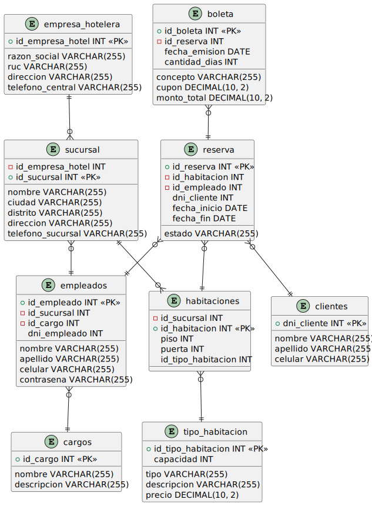

# Reservas Hoteleras

Bienvenido al proyecto de Reservas Hoteleras, un sistema de reservas de hoteles desarrollado en Java como parte del curso de Programación Orientada a Objetos. Este proyecto utiliza una base de datos alojada en SQL Azure para almacenar la información relacionada con los hoteles, las habitaciones y las reservas.

Creado con:
* Java with Ant
* Java Swing
* SQL Azure


## Patrones de Diseño y Estructura de carpetas

En este proyecto hacemos uso de los patrones MVC (Modelo Vista Controlador) y DAO (Data Access Object) para lograr una arquitectura más modular, separando las responsabilidades y facilitando el mantenimiento y la escalabilidad de la aplicación.

| Paquete | Descripción |
|-----|--------|
| Configuracion | Contiene la clase que se encarga de leer el archivo de configuración *config.properties* y de establecer la conexión con la base de datos. |
| Modelo | Contiene las clases que representan a la base de datos. |
| Interfaces | La interfaz contiene las implementaciones de las clases del paquete `Modelo` a través de una interfaz CRUD que utiliza un tipo genérico. |
| ModeloDAO | Contiene las clases que se encargan de realizar las operaciones de acceso a datos (CRUD) sobre la base de datos. Emplean las interfaces del paquete `Interfaces`. |
| Vista | Contiene las clases que representan a las ventanas de la aplicación.   |


## Requisitos

Antes de ejecutar el proyecto, asegúrate de tener instalados los siguientes requisitos:

- Java Development Kit (JDK / OpenJDK) 8 o superior.
- Un entorno de desarrollo integrado (IDE) compatible con Java, recomendamos NetBeans 17 o superior.
- Acceso a una base de datos SQL Azure. Puedes obtener una cuenta gratuita de Azure y crear una base de datos para este proyecto con [nuestra estructura de tablas y datos de prueba](https://github.com/Leo-Spj/Java-POO-UTP/tree/main/Base%20de%20Datos), siguiendo los pasos descritos en el siguiente artículo: [Crear una base de datos SQL Azure](https://docs.microsoft.com/en-us/azure/azure-sql/database/single-database-create-quickstart?tabs=azure-portal).
- Deberá configurar el archivo `config.properties` con los datos de conexión a la base de datos SQL Azure. Puede encontrar un [ejemplo de este archivo aquí](https://github.com/Leo-Spj/Java-POO-UTP/blob/main/Base%20de%20Datos/config.properties), luego este archivo se deberá colocar en la raíz del proyecto.

## Configuración

1. Clona este repositorio en tu máquina local utilizando el siguiente comando:

```bash
git clone https://github.com/Leo-Spj/Java-POO-UTP.git
```	

2. Agrega el archivo `config.properties` en la raíz del proyecto con los datos de conexión a la base de datos SQL Azure. Puede encontrar un [ejemplo de este archivo aquí](https://github.com/Leo-Spj/Java-POO-UTP/blob/main/Base%20de%20Datos/config.properties)

3. Configura las dependencias del proyecto. Agrega los .jar que que se encuentran en la carpeta `Library` . Puedes encontrar más información sobre cómo agregar dependencias en los siguientes artículos: 
    * [NetBeans](https://parzibyte.me/blog/2019/02/15/anadir-librerias-archivos-jar-netbeans/)
    * [Intellij IDEA](https://www.jetbrains.com/help/idea/library.html#add-library-to-module-dependencies)
    


-------------------------


# Diagrama Base de Datos



