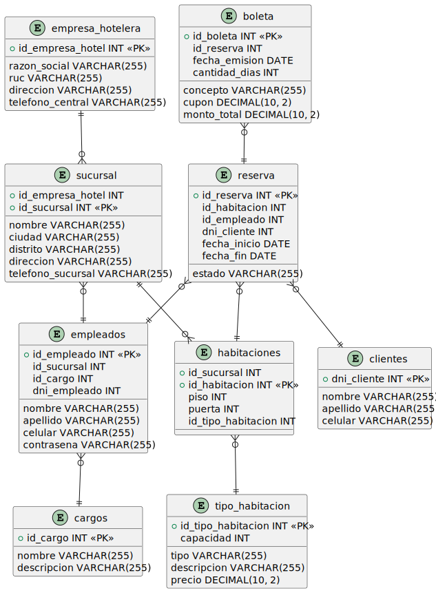

# Reservas Hoteleras

Bienvenido al proyecto de Reservas Hoteleras, un sistema de reservas de hoteles desarrollado en Java como parte del curso de Programación Orientada a Objetos. Este proyecto utiliza una base de datos alojada en SQL Azure para almacenar la información relacionada con los hoteles, las habitaciones y las reservas.

Creado con:
* Java with Ant
* Java Swing
* SQL Azure


## Estructura de carpetas

El proyecto sigue una estructura de carpetas organizada en los siguientes directorios:

- `configuracion`: Contiene la configuración del proyecto, como archivos de configuración o propiedades.
- `controlador`: Contiene los controladores del proyecto, encargados de manejar las interacciones entre el modelo y las vistas.
- `modelo`: Contiene las clases del modelo de dominio del proyecto, como las clases de Hotel, Habitación, Reserva, etc.
- `vistas`: Contiene las vistas del proyecto, como las interfaces de usuario y las pantallas de visualización.

## Requisitos

Antes de ejecutar el proyecto, asegúrate de tener instalados los siguientes requisitos:

- Java Development Kit (JDK) 8 o superior.
- Se debe tener instalado el [driver de SQL Server para Java](https://docs.microsoft.com/en-us/sql/connect/jdbc/download-microsoft-jdbc-driver-for-sql-server?view=sql-server-ver15).
- Un entorno de desarrollo integrado (IDE) compatible con Java, recomendamos NetBeans 17 o superior.
- Acceso a una base de datos SQL Azure. Puedes obtener una cuenta gratuita de Azure y crear una base de datos para este proyecto con [nuestra estructura de tablas y datos de prueba](https://github.com/Leo-Spj/Java-POO-UTP/tree/main/Base%20de%20Datos), siguiendo los pasos descritos en el siguiente artículo: [Crear una base de datos SQL Azure](https://docs.microsoft.com/en-us/azure/azure-sql/database/single-database-create-quickstart?tabs=azure-portal).
- Deberá configurar el archivo `config.properties` con los datos de conexión a la base de datos SQL Azure. Puede encontrar un [ejemplo de este archivo aquí](https://github.com/Leo-Spj/Java-POO-UTP/blob/main/Base%20de%20Datos/config.properties), luego este archivo se deberá colocar en la raíz del proyecto.

## Configuración

1. Clona este repositorio en tu máquina local utilizando el siguiente comando:

```bash
git clone https://github.com/Leo-Spj/Java-POO-UTP.git
```	

2. Agrega el archivo `config.properties` en la raíz del proyecto con los datos de conexión a la base de datos SQL Azure. Puede encontrar un [ejemplo de este archivo aquí](https://github.com/Leo-Spj/Java-POO-UTP/blob/main/Base%20de%20Datos/config.properties)

3. Configura las dependencias del proyecto. Agrega los .jar que que se encuentran en la carpeta `Library` . Puedes encontrar más información sobre cómo agregar dependencias en los siguientes artículos: 
    * [NetBeans](https://docs.oracle.com/netbeans/nb82/netbeans/NBDAG/build_japps.htm#NBDAG552)
    * [Intellij IDEA](https://www.jetbrains.com/help/idea/library.html#add-library-to-module-dependencies)
    


-------------------------


# Base de datos TRAVEL_EASY



